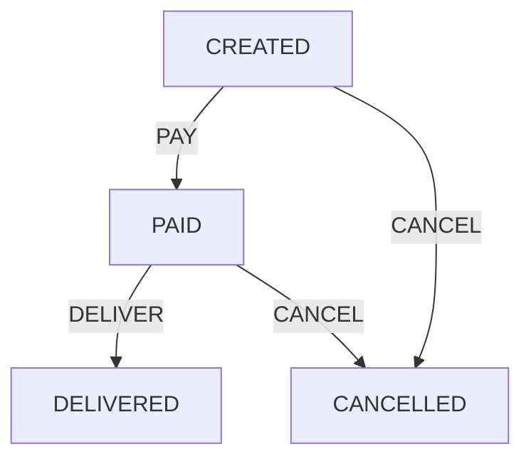

<!-- FSM-Go Logo and Title -->
<div align="center">
  <h1>FSM-Go</h1>
  <p><strong>A Lightweight Finite State Machine for Go</strong></p>
  <p>
    <a href="#installation">Installation</a> •
    <a href="#features">Features</a> •
    <a href="#usage">Usage</a> •
    <a href="#core-concepts">Core Concepts</a> •
    <a href="#examples">Examples</a> •
    <a href="#advanced-features">Advanced Features</a>
  </p>
  <p><a href="#中文文档">中文文档</a></p>
</div>

---

## 🚀 Overview

FSM-Go is a lightweight, high-performance, stateless finite state machine implementation in Go, inspired by Alibaba's COLA state machine component. It provides a fluent API for defining state machines with type safety using Go generics.

## ✨ Features

- 🪶 **Lightweight and stateless** design for high performance
- 🔒 **Type-safe** implementation using Go generics
- 🔄 **Fluent API** for defining state machines
- 🔀 **Versatile transitions**:
  - External transitions between different states
  - Internal transitions within the same state
  - Parallel transitions to multiple target states
  - Multiple source transitions from different states to one target
- 🧩 **Function type support** for simplified condition and action definitions
- 🔍 **Conditional transitions** with custom logic
- 🎬 **Actions** that execute during transitions
- ✅ **Transition verification** capability
- 🔄 **Thread-safe** for concurrent use
- 📊 **Visualization support** for state machine diagrams (PlantUML, Markdown tables, and Mermaid flowcharts)

## 📦 Installation

```bash
go get github.com/lingcoder/fsm-go
```

## 🔍 Usage

```go
package main

import (
	"fmt"
	"log"

	"github.com/lingcoder/fsm-go"
)

// Define states
type OrderState string

const (
	OrderCreated   OrderState = "CREATED"
	OrderPaid      OrderState = "PAID"
	OrderShipped   OrderState = "SHIPPED"
	OrderDelivered OrderState = "DELIVERED"
	OrderCancelled OrderState = "CANCELLED"
)

// Define events
type OrderEvent string

const (
	EventPay     OrderEvent = "PAY"
	EventShip    OrderEvent = "SHIP"
	EventDeliver OrderEvent = "DELIVER"
	EventCancel  OrderEvent = "CANCEL"
)

// Define context
type OrderContext struct {
	OrderID   string
	UserID    string
	Amount    float64
}

// Using function types for conditions and actions
func main() {
	// Create a builder
	builder := fsm.NewStateMachineBuilder[OrderState, OrderEvent, OrderContext]()
	
	// Define the state machine - using function types for simplicity
	builder.ExternalTransition().
		From(OrderCreated).
		To(OrderPaid).
		On(EventPay).
		WhenFunc(func(ctx OrderContext) bool {
			return ctx.Amount > 0
		}).
		PerformFunc(func(from, to OrderState, event OrderEvent, ctx OrderContext) error {
			fmt.Printf("Order %s paid amount %.2f\n", ctx.OrderID, ctx.Amount)
			return nil
		})
	
	builder.ExternalTransition().
		From(OrderPaid).
		To(OrderShipped).
		On(EventShip).
		PerformFunc(func(from, to OrderState, event OrderEvent, ctx OrderContext) error {
			fmt.Printf("Order %s has been shipped\n", ctx.OrderID)
			return nil
		})
	
	// Using multiple transitions - from multiple states to one state
	builder.ExternalTransitions().
		FromAmong(OrderCreated, OrderPaid, OrderShipped).
		To(OrderCancelled).
		On(EventCancel).
		PerformFunc(func(from, to OrderState, event OrderEvent, ctx OrderContext) error {
			fmt.Printf("Order %s cancelled from %s state\n", ctx.OrderID, from)
			return nil
		})
	
	// Build the state machine
	stateMachine, err := builder.Build("OrderStateMachine")
	if err != nil {
		log.Fatalf("Failed to build state machine: %v", err)
	}
	
	// Use the state machine
	ctx := OrderContext{
		OrderID: "ORD-001",
		UserID:  "USR-001",
		Amount:  100.0,
	}
	
	// Verify if transition is possible
	if stateMachine.Verify(OrderCreated, EventPay) {
		fmt.Println("Order can be paid")
	}
	
	// Transition from CREATED to PAID
	newState, err := stateMachine.FireEvent(OrderCreated, EventPay, ctx)
	if err != nil {
		log.Fatalf("Failed to transition: %v", err)
	}
	
	fmt.Printf("New state: %v\n", newState)
}

## 🧩 Core Concepts

| Concept | Description |
|---------|-------------|
| **State** | Represents a specific state in your business process |
| **Event** | Triggers state transitions |
| **Transition** | Defines how states change in response to events |
| **Condition** | Logic that determines if a transition should occur |
| **Action** | Logic executed when a transition occurs |
| **StateMachine** | The core component that manages states and transitions |

### Transition Types

- **External Transition**: Transition between different states
- **Internal Transition**: Actions within the same state
- **Parallel Transition**: Transition from one state to multiple target states
- **Multiple Transition**: Transition from multiple source states to one target state

## 📚 Examples

Check the `examples` directory for more detailed examples:

- `examples/order`: Order processing workflow
- `examples/workflow`: Approval workflow
- `examples/game`: Game state management

## 🔧 Advanced Features

### Function Type Support

You can use functions directly as conditions and actions without defining structs:

```go
// Using a function as a condition
.WhenFunc(func(ctx OrderContext) bool {
    return ctx.Amount > 0
})

// Using a function as an action
.PerformFunc(func(from, to OrderState, event OrderEvent, ctx OrderContext) error {
    fmt.Printf("Processing order %s\n", ctx.OrderID)
    return nil
})
```

### Parallel Transitions

An event can trigger transitions to multiple target states:

```go
builder.ExternalParallelTransition().
    From(OrderPaid).
    ToAmong(OrderShipped, OrderNotified).
    On(EventProcess).
    PerformFunc(func(from, to OrderState, event OrderEvent, ctx OrderContext) error {
        fmt.Printf("Processing order: %s\n", ctx.OrderID)
        return nil
    })

// Trigger parallel transition
newStates, err := stateMachine.FireParallelEvent(OrderPaid, EventProcess, ctx)
```

### Multiple Transitions

Transitions from multiple source states to a single target state:

```go
builder.ExternalTransitions().
    FromAmong(OrderCreated, OrderPaid, OrderShipped).  // Multiple source states
    To(OrderCancelled).  // Target state
    On(EventCancel).     // Triggering event
    PerformFunc(cancelAction)  // Transition action
```

### Transition Verification

Verify if a transition is possible before executing it:

```go
if stateMachine.Verify(currentState, event) {
    // Transition is possible
    newState, err := stateMachine.FireEvent(currentState, event, ctx)
} else {
    // Transition is not possible
    fmt.Println("Cannot perform this operation in current state")
}
```

## ⚡ Performance

FSM-Go is designed for high performance:

- **Stateless design** minimizes memory usage
- **Efficient transition lookup**
- **Thread-safe** for concurrent use
- **Benchmarks** included in the test suite

## 🔍 Implementation Details

### StateMachine Interface

```go
type StateMachine[S comparable, E comparable, C any] interface {
	// FireEvent triggers a state transition based on the current state and event
	// Returns the new state and any error that occurred
	FireEvent(sourceState S, event E, ctx C) (S, error)

	// FireParallelEvent triggers parallel state transitions
	// Returns a list of new states and any error that occurred
	FireParallelEvent(sourceState S, event E, ctx C) ([]S, error)
	
	// Verify checks if there is a valid transition for the given state and event
	// Returns whether a valid transition exists
	Verify(sourceState S, event E) bool

	// ShowStateMachine returns a string representation of the state machine
	ShowStateMachine() string

	// GenerateDiagram returns a diagram of the state machine in the specified formats
	// If formats is nil or empty, defaults to PlantUML
	// If multiple formats are provided, returns all requested formats concatenated
	GenerateDiagram(formats ...DiagramFormat) string
}
```

### Builder API

FSM-Go uses a fluent builder API to define state machines:

```go
// Create a builder
builder := fsm.NewStateMachineBuilder[OrderState, OrderEvent, OrderContext]()

// Define external transition
builder.ExternalTransition().
    From(OrderCreated).  // Source state
    To(OrderPaid).       // Target state
    On(EventPay).        // Triggering event
    WhenFunc(func(ctx OrderContext) bool { return ctx.Amount > 0 }).  // Transition condition
    PerformFunc(func(from, to OrderState, event OrderEvent, ctx OrderContext) error {  // Transition action
        fmt.Printf("Processing payment: %.2f\n", ctx.Amount)
        return nil
    })

// Define parallel transition
builder.ExternalParallelTransition().
    From(OrderPaid).
    ToAmong(OrderShipped, OrderNotified).
    On(EventProcess).
    PerformFunc(processAction)

// Define multiple source transitions
builder.ExternalTransitions().
    FromAmong(OrderCreated, OrderPaid, OrderShipped).  // Multiple source states
    To(OrderCancelled).  // Target state
    On(EventCancel).     // Triggering event
    PerformFunc(cancelAction)  // Transition action

// Build the state machine
stateMachine, err := builder.Build("OrderStateMachine")
```

## 📄 License

MIT

### Visualization

FSM-Go provides a unified way to visualize your state machine with different formats:

```go
// Default format (PlantUML)
plantUML := stateMachine.GenerateDiagram()

// Generate specific format
table := stateMachine.GenerateDiagram(fsm.MarkdownTable)     // Markdown table format
flow := stateMachine.GenerateDiagram(fsm.MarkdownFlow)       // Markdown flow chart format

// Generate multiple formats at once
combined := stateMachine.GenerateDiagram(fsm.PlantUML, fsm.MarkdownTable, fsm.MarkdownFlow)

// For backward compatibility, these methods are still available but deprecated
plantUML = stateMachine.GeneratePlantUML()
table = stateMachine.GenerateMarkdown()
flow = stateMachine.GenerateMarkdownFlowchart()
```

The Markdown output provides a readable table of all transitions:

```markdown
# State Machine: OrderStateMachine

## States

- `CREATED`
- `PAID`
- `DELIVERED`
- `CANCELLED`

## Transitions

| Source State | Event | Target State | Type |
|-------------|-------|--------------|------|
| `CREATED` | `PAY` | `PAID` | External |
| `PAID` | `DELIVER` | `DELIVERED` | External |
| `CREATED` | `CANCEL` | `CANCELLED` | External |
| `PAID` | `CANCEL` | `CANCELLED` | External |
```

The Mermaid flowchart provides a visual diagram that can be rendered in Markdown editors that support Mermaid:

```markdown

```

<div align="center">
  <h1>中文文档</h1>
</div>

FSM-Go 是一个轻量级、高性能、无状态的有限状态机 Go 实现，灵感来自阿里巴巴的 COLA 状态机组件。

## ✨ 特性

- 🪶 **轻量级和无状态设计**，提供高性能
- 🔒 使用 **Go 泛型**实现类型安全
- 🔄 **流畅的 API** 用于定义状态机
- 🔀 **多种转换类型**：
  - 外部状态转换
  - 内部状态转换
  - 并行转换
  - 批量转换
- 🧩 **函数类型支持**，简化条件和动作的定义
- 🔍 带有**自定义逻辑的条件转换**
- 🎬 转换过程中执行的**动作**
- ✅ **状态转换验证**功能
- 🔄 **线程安全**，支持并发使用
- 📊 支持**状态机图表可视化** (PlantUML, Markdown 表格和 Mermaid 流程图)

## 📦 安装

```bash
go get github.com/lingcoder/fsm-go
```

## 🔍 使用方法

```go
package main

import (
	"fmt"
	"log"

	"github.com/lingcoder/fsm-go"
)

// 定义状态
type OrderState string

const (
	OrderCreated   OrderState = "CREATED"
	OrderPaid      OrderState = "PAID"
	OrderShipped   OrderState = "SHIPPED"
	OrderDelivered OrderState = "DELIVERED"
	OrderCancelled OrderState = "CANCELLED"
)

// 定义事件
type OrderEvent string

const (
	EventPay     OrderEvent = "PAY"
	EventShip    OrderEvent = "SHIP"
	EventDeliver OrderEvent = "DELIVER"
	EventCancel  OrderEvent = "CANCEL"
)

// 定义上下文
type OrderContext struct {
	OrderID   string
	UserID    string
	Amount    float64
}

// 使用函数类型定义动作和条件
func main() {
	// 创建构建器
	builder := fsm.NewStateMachineBuilder[OrderState, OrderEvent, OrderContext]()
	
	// 定义状态机 - 使用函数类型简化定义
	builder.ExternalTransition().
		From(OrderCreated).
		To(OrderPaid).
		On(EventPay).
		WhenFunc(func(ctx OrderContext) bool {
			return ctx.Amount > 0
		}).
		PerformFunc(func(from, to OrderState, event OrderEvent, ctx OrderContext) error {
			fmt.Printf("订单 %s 支付了 %.2f 元\n", ctx.OrderID, ctx.Amount)
			return nil
		})
	
	builder.ExternalTransition().
		From(OrderPaid).
		To(OrderShipped).
		On(EventShip).
		PerformFunc(func(from, to OrderState, event OrderEvent, ctx OrderContext) error {
			fmt.Printf("订单 %s 已发货\n", ctx.OrderID)
			return nil
		})
	
	// 使用批量转换 - 从多个状态到一个状态
	builder.ExternalTransitions().
		FromAmong(OrderCreated, OrderPaid, OrderShipped).
		To(OrderCancelled).
		On(EventCancel).
		PerformFunc(func(from, to OrderState, event OrderEvent, ctx OrderContext) error {
			fmt.Printf("订单 %s 从 %s 状态被取消\n", ctx.OrderID, from)
			return nil
		})
	
	// 构建状态机
	stateMachine, err := builder.Build("OrderStateMachine")
	if err != nil {
		log.Fatalf("构建状态机失败: %v", err)
	}
	
	// 使用状态机
	ctx := OrderContext{
		OrderID: "ORD-001",
		UserID:  "USR-001",
		Amount:  100.0,
	}
	
	// 验证转换是否可行
	if stateMachine.Verify(OrderCreated, EventPay) {
		fmt.Println("订单可以支付")
	}
	
	// 从 CREATED 转换到 PAID
	newState, err := stateMachine.FireEvent(OrderCreated, EventPay, ctx)
	if err != nil {
		log.Fatalf("转换失败: %v", err)
	}
	
	fmt.Printf("新状态: %v\n", newState)
}

## 🧩 核心概念

| 概念 | 描述 |
|------|------|
| **状态 (State)** | 表示业务流程中的特定状态 |
| **事件 (Event)** | 触发状态转换 |
| **转换 (Transition)** | 定义状态如何响应事件而变化 |
| **条件 (Condition)** | 决定是否应该发生转换的逻辑 |
| **动作 (Action)** | 转换发生时执行的逻辑 |
| **状态机 (StateMachine)** | 管理状态和转换的核心组件 |

### 转换类型

- **外部转换 (External Transition)**: 不同状态之间的转换
- **内部转换 (Internal Transition)**: 同一状态内的动作
- **并行转换 (Parallel Transition)**: 一个事件触发到多个目标状态的转换
- **批量转换 (Multiple Transition)**: 多个源状态到一个目标状态的转换

## 📚 示例

查看 `examples` 目录获取更详细的示例：

- `examples/order`: 订单处理工作流
- `examples/workflow`: 审批工作流
- `examples/game`: 游戏状态管理

## 🔧 高级功能

### 函数类型支持

可以直接使用函数作为条件和动作，无需定义结构体：

```go
// 使用函数作为条件
.WhenFunc(func(ctx OrderContext) bool {
    return ctx.Amount > 0
})

// 使用函数作为动作
.PerformFunc(func(from, to OrderState, event OrderEvent, ctx OrderContext) error {
    fmt.Printf("处理订单 %s\n", ctx.OrderID)
    return nil
})
```

### 并行转换

一个事件可以触发到多个目标状态的转换：

```go
builder.ExternalParallelTransition().
    From(OrderPaid).
    ToAmong(OrderShipped, OrderNotified).
    On(EventProcess).
    PerformFunc(func(from, to OrderState, event OrderEvent, ctx OrderContext) error {
        fmt.Printf("处理订单: %s\n", ctx.OrderID)
        return nil
    })

// 触发并行转换
newStates, err := stateMachine.FireParallelEvent(OrderPaid, EventProcess, ctx)
```

### 批量转换

从多个源状态到一个目标状态的转换：

```go
builder.ExternalTransitions().
    FromAmong(OrderCreated, OrderPaid, OrderShipped).
    To(OrderCancelled).
    On(EventCancel).
    PerformFunc(cancelAction)
```

### 转换验证

在执行转换前验证是否可行：

```go
if stateMachine.Verify(currentState, event) {
    // 可以执行转换
    newState, err := stateMachine.FireEvent(currentState, event, ctx)
} else {
    // 转换不可行
    fmt.Println("当前状态不能执行此操作")
}
```

## ⚡ 性能

FSM-Go 设计注重高性能：

- **无状态设计**最小化内存使用
- **高效的转换查找**
- **线程安全**，支持并发使用
- 测试套件中包含**基准测试**

## 🔍 实现细节

### 状态机接口

```go
type StateMachine[S comparable, E comparable, C any] interface {
	// FireEvent 触发基于当前状态和事件的状态转换
	// 返回新状态和可能发生的错误
	FireEvent(sourceState S, event E, ctx C) (S, error)

	// FireParallelEvent 触发并行状态转换
	// 返回新状态列表和可能发生的错误
	FireParallelEvent(sourceState S, event E, ctx C) ([]S, error)
	
	// Verify 检查给定状态和事件是否有有效的转换
	// 返回是否存在有效转换
	Verify(sourceState S, event E) bool

	// ShowStateMachine 返回状态机的字符串表示
	ShowStateMachine() string

	// GenerateDiagram 返回状态机的图表
	// Formats 可以是 "plantuml"、"table" 或 "flow"
	// 如果 formats 为空或 nil，则默认为 "plantuml"
	// 如果提供多种格式，则返回所有请求的格式的连接
	GenerateDiagram(formats ...DiagramFormat) string
}
```

### 构建器 API

FSM-Go 使用流畅的构建器 API 来定义状态机：

```go
// 创建构建器
builder := fsm.NewStateMachineBuilder[OrderState, OrderEvent, OrderContext]()

// 定义外部转换
builder.ExternalTransition().
    From(OrderCreated).  // 源状态
    To(OrderPaid).       // 目标状态
    On(EventPay).        // 触发事件
    WhenFunc(func(ctx OrderContext) bool { return ctx.Amount > 0 }).  // 转换条件
    PerformFunc(func(from, to OrderState, event OrderEvent, ctx OrderContext) error {  // 转换动作
        fmt.Printf("处理支付: %.2f\n", ctx.Amount)
        return nil
    })

// 定义并行转换
builder.ExternalParallelTransition().
    From(OrderPaid).
    ToAmong(OrderShipped, OrderNotified).
    On(EventProcess).
    PerformFunc(processAction)

// 定义多源状态转换
builder.ExternalTransitions().
    FromAmong(OrderCreated, OrderPaid, OrderShipped).  // 多个源状态
    To(OrderCancelled).  // 目标状态
    On(EventCancel).     // 触发事件
    PerformFunc(cancelAction)  // 转换动作

// 构建状态机
stateMachine, err := builder.Build("OrderStateMachine")
```

## 📄 许可证

MIT

### 可视化

FSM-Go 提供一种统一的方式来可视化状态机：

```go
// 默认格式 (PlantUML)
plantUML := stateMachine.GenerateDiagram()

// 生成特定格式
table := stateMachine.GenerateDiagram(fsm.MarkdownTable)     // Markdown 表格格式
flow := stateMachine.GenerateDiagram(fsm.MarkdownFlow)       // Markdown 流程图格式

// 生成多种格式
combined := stateMachine.GenerateDiagram(fsm.PlantUML, fsm.MarkdownTable, fsm.MarkdownFlow)

// 为向后兼容，这些方法仍然可用但已弃用
plantUML = stateMachine.GeneratePlantUML()
table = stateMachine.GenerateMarkdown()
flow = stateMachine.GenerateMarkdownFlowchart()
```

Markdown 输出提供了一个可读的转换表格：

```markdown
# 状态机：OrderStateMachine

## 状态

- `CREATED`
- `PAID`
- `DELIVERED`
- `CANCELLED`

## 转换

| 源状态 | 事件 | 目标状态 | 类型 |
|--------|------|----------|------|
| `CREATED` | `PAY` | `PAID` | External |
| `PAID` | `DELIVER` | `DELIVERED` | External |
| `CREATED` | `CANCEL` | `CANCELLED` | External |
| `PAID` | `CANCEL` | `CANCELLED` | External |
```

Mermaid 流程图提供了一个可视化的图表，可以在支持 Mermaid 的 Markdown 编辑器中渲染：

```markdown

